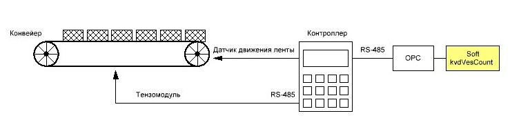
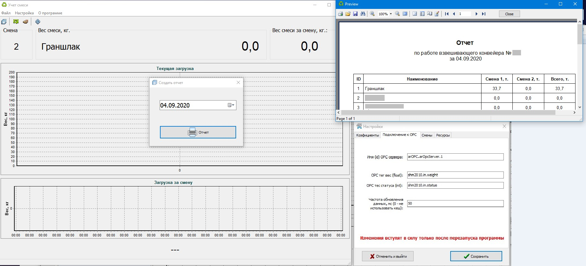

# kvdVesCount (beta-test)

 Program for continuous weighing (accounting) of the mixture components on the conveyor.

Программа непрерывного взвешивание (учета) компонентов смеси (сыпучие материалы) на конвейере.

Интерфейс программы.

Используемые компоненты для сборки в Delphi 7:

- [FastReport](https://www.fastreport.ru/ru/) - отчеты
- lib [prOpc](https://github.com/engycz/propc) - клиент/сервер OPC DA2
- lib [log4delphi](http://log4delphi.sourceforge.net/) - логи
- TChart - Графики